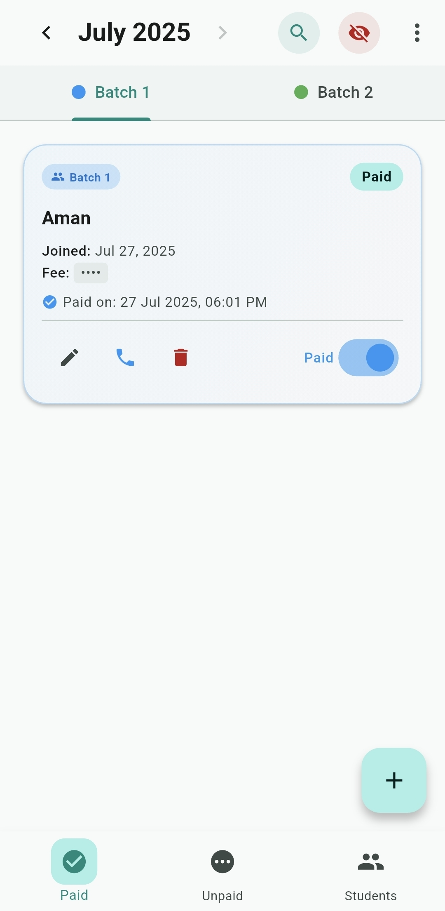
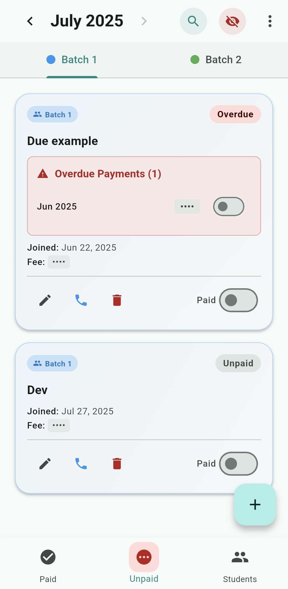
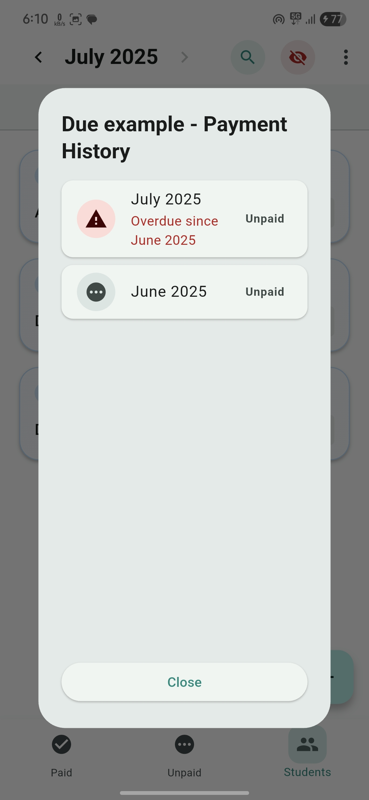
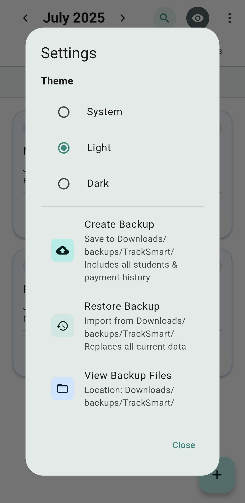

# Track Smart

> A Flutter-based Android application for managing student tuition fees, payment status, and monthly records.

Track Smart is a mobile application designed for tuition teachers to manage student fee records across multiple batches. It was developed around a real-world workflow and focuses on making monthly payment tracking, overdue identification, searching, and record management simple and efficient.

## Overview

Managing student payments manually can become error-prone as the number of students and monthly records grows.

Track Smart provides a centralized interface to:

- Track students across multiple batches
- Record monthly fee payments
- Identify unpaid and overdue fees
- Review historical payment records
- Search students quickly
- Contact students directly
- Back up and restore application data

The application was designed around the requirements of a former tuition teacher and implemented as a practical Android application with local data persistence.

## Features

### Student & Batch Management

- Organize students across multiple batches
- View and manage student records
- Search students by name or batch

### Payment Tracking

- Track monthly fee payments
- Separate paid and unpaid students
- Highlight overdue payments
- Maintain payment history

### Communication

- Initiate phone calls directly from student records

### Data Management

- Export application data as JSON
- Restore records from a previous backup
- Preserve payment history across backups

### User Experience

- Clean Material-based interface
- Custom UI styling
- Clear visual indicators for payment status
- Simple navigation for frequent daily operations

## Screenshots

### Paid Students



### Unpaid Students



### Payment History



### Settings



## Architecture

The application follows a layered structure that separates presentation, state management, and persistence.

```text
UI
│
├── Screens / Widgets
│
├── ViewModels
│
├── Repository Layer
│
├── Services
│
└── SQLite Database
```

This structure keeps presentation logic, application state, data access, and supporting services separated, making the codebase easier to maintain and extend.

## Tech Stack

| Layer | Technology |
|---|---|
| Framework | Flutter |
| Language | Dart |
| Platform | Android |
| State Management | Provider |
| Local Database | SQLite / sqflite |
| UI | Material Design |
| Data Backup | JSON |

## Project Structure

```text
lib/
├── database/
│   ├── app_database.dart
│   └── database_helper.dart
├── models/
│   ├── payment.dart
│   └── student.dart
├── repositories/
│   └── student_repository.dart
├── screens/
│   ├── widgets/
│   └── main_screen.dart
├── services/
│   ├── simple_export_service.dart
│   └── theme_service.dart
├── viewmodels/
└── main.dart
```

## Getting Started

### Prerequisites

- Flutter SDK
- Dart SDK
- Android Studio or another Flutter-compatible IDE
- Android device or emulator

### Installation

Clone the repository:

```bash
git clone https://github.com/vinayr-07/Track-Smart.git
cd Track-Smart
```

Install dependencies:

```bash
flutter pub get
```

Run the application:

```bash
flutter run
```

## APK

A pre-built Android APK is available in the repository releases:

[Download the latest APK](https://github.com/vinayr-07/Track-Smart/releases)

## Design Goals

The application was designed around several practical requirements:

- Keep the workflow simple for non-technical users
- Make payment status immediately visible
- Minimize the number of steps required for common actions
- Keep core data available locally
- Provide backup and restore capabilities
- Make monthly payment management straightforward

## Engineering Challenges

Some of the key implementation areas included:

- Designing a local data model for students and monthly payments
- Managing payment history and overdue status
- Keeping UI state synchronized with persistent data
- Implementing search and filtering across student records
- Supporting backup and restore
- Structuring the Flutter application into maintainable layers

## Future Improvements

Potential improvements include:

- Cloud synchronization
- Multiple teacher accounts
- Automated payment reminders
- Monthly reports and analytics
- CSV and PDF export
- Automated recurring payment schedules
- Role-based access control

## Project Context

Track Smart was developed around the real-world workflow of a former tuition teacher.

The project was built to solve a practical record-management problem rather than as a purely academic exercise. The focus was on translating real user requirements into a usable mobile application.

## License

This project is licensed under the [MIT License](LICENSE).
