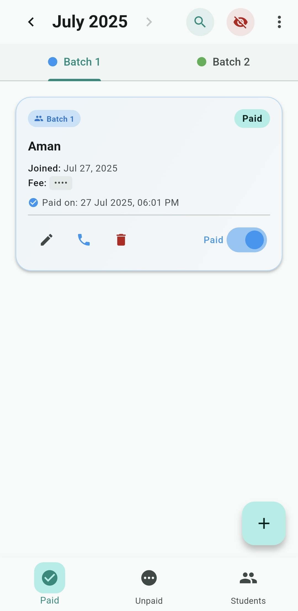
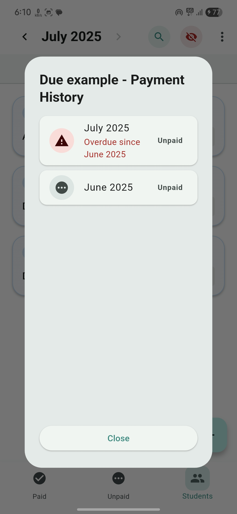
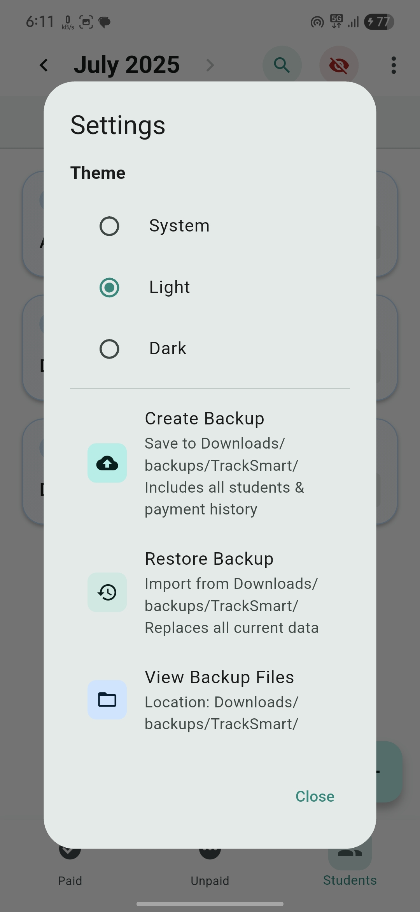

# 📚 Track Smart — Tuition Fee Tracker App

**Track Smart** is a simple Flutter-based Android application built to help tuition teachers efficiently manage student fee records for **two batches** (B1 & B2). The app clearly separates **Paid** and **Unpaid** students, highlights overdue payments, and includes powerful tools like calling, global search, and JSON backup — all wrapped in a clean, modern UI.

> ⚡ App logic, structure, and UX design were conceived and planned by me. AI was used as an assistant for implementing the code professionally.

---

## 🚀 Features

- 🎯 Track fee payments for **two batches** (B1 & B2)
- 📅 View monthly paid/unpaid student lists
- 🔴 Overdue payments are shown in red
- 📞 One-tap call functionality to students
- 📁 JSON backup and restore
- 🔍 Global search by name or batch
- 🌈 Clean UI with gradients and icon

---

## 📦 Download APK

➡️ [**Click here to download the latest APK**](https://github.com/vinayr-07/Track-Smart/releases)  
(Located under the **Releases** section of this repository)

---

## 📸 Screenshots

### ✅ Paid Tab

### ❌ Unpaid Tab

### ✅ History 

### ⚙️ Settings Page

---

## 🛠 Tech Stack

- **Framework:** Flutter
- **Language:** Dart
- **Platform:** Android
- **UI:** Material Design with custom styling

---

## 🧠 Developer Insight

> I designed this app completely from scratch for my former tuition teacher, based on their real-world needs.  
> While I had no prior experience in Android development, I used AI tools to convert my ideas into working, production-ready code.  
> This is a proof of concept that creativity, logic, and AI together can build real software solutions.

---

## 🙏 Acknowledgement

- 💡 **Perplexity AI** — for code generation and development help

---

## 📄 License

This project is licensed under the [MIT License](LICENSE).

---

## ✨ About

Made with ❤️ for personal use — practical, minimal, and smart.
